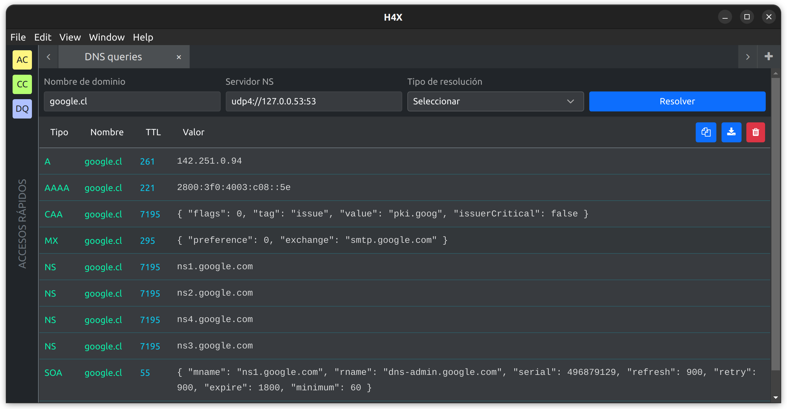
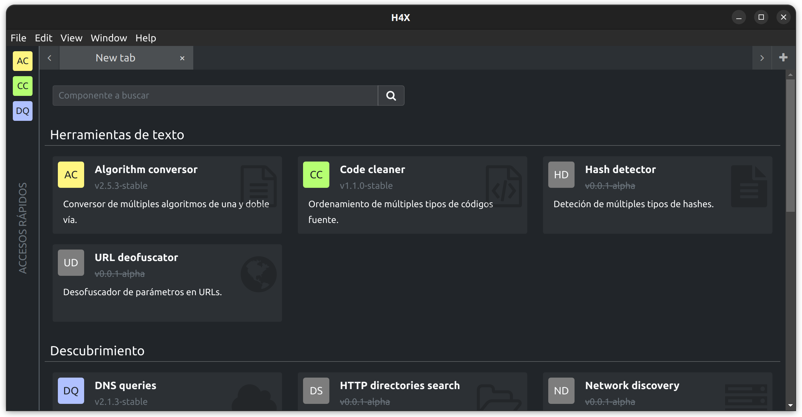

# H4X

Graphical pentesting tool using [Electron](https://www.electronjs.org/) and
[NodeJS](https://nodejs.org/es/).





Supported languages:

- English
- Spanish
- Esperanto


## Requirements

- NodeJS >= 16.14.2 LTS


## How to run

In the `app` directory run:

```bash
npm install && npm start
```


## How to build

In the `app` directory run:

```bash
npm run make
```


## Components status

| Category  | Component                     | Status             |
|-----------|-------------------------------|--------------------|
| Tools     | Conversor                     | Stable             |
| Tools     | Code cleaner                  | Stable             |
| Tools     | Hash detector                 | Under construction |
| Tools     | URL deofuscator               | Under construction |
| Discovery | HTTP directory scann          | Under construction |
| Discovery | DNS Records                   | Beta               |
| Discovery | Network discover              | Under construction |
| Discovery | Port scanner                  | Under construction |
| Discovery | Subdomains scanner            | Under construction |
| Clients   | Plain socket                  | Under construction |
| Clients   | JSON/REST                     | Under construction |
| Clients   | XML/SOAP                      | Under construction |
| Clients   | Connections flow              | Under construction |
| Panic     | Secure deletion local fingers | Under construction |
| Panic     | Secure deletion local files   | Under construction |


## Support

This software is free and its source code is totally free for you to use and learn. Support the creator.

[](https://www.paypal.com/donate/?hosted_button_id=KM2KBE8F982KS)
